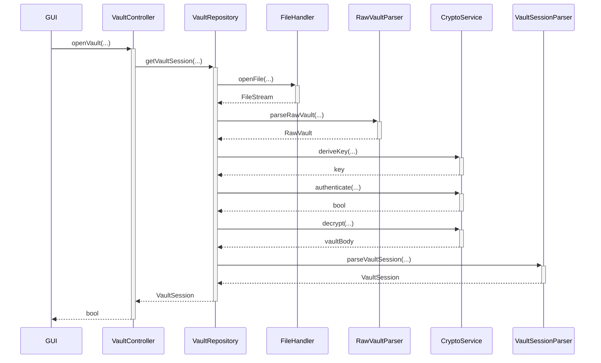
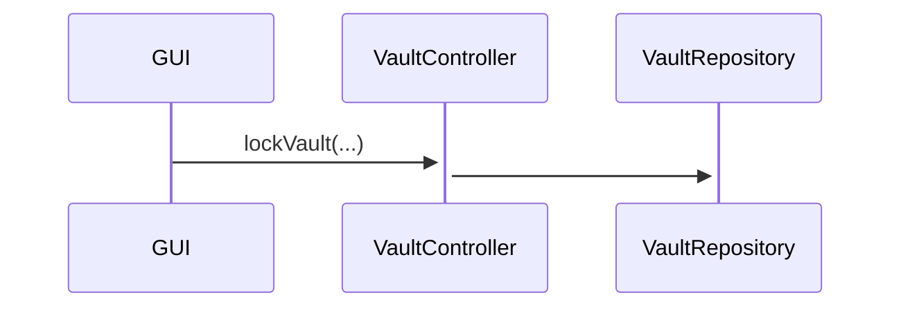

# Diagrams

## Class diagram

```mermaid
classDiagram
    class VaultRepository{
        +getVaultSession(String Masterpass, String filename): VaultSession
        +writeVaultSession(VaultSession session):void
        +createVault(String name, String filename, String masterpass):VaultSession
        +vaultExists(String filename): bool
    }
    class CryptoService{
        +deriveKey(byte[] masterpass, byte[] salt, int opLimits, int memoryLimit): byte[]
        +authenticate(byte[] key, byte[] content): byte[]
        +encrypt(byte[] key, byte[] plaintext): byte[]
        +decrypt(byte[] key, byte[] ciphertext): String
    }
    class RawVaultParser{
      +parseRawVault(Stream file): RawVault
      +serializeRawVault(RawVault vault):Stream
    }
    class VaultSessionParser{
      +parseVaultSession(String vaultBody): VaultSession
      +serializeVaultSession(VaultSession session): String
    }
    class VaultController{
      +session: VaultSesssion
      +openVault(String Masterpass, String filename): bool
      +lockVault(): void
      +isVaultUnlocked(): bool
      +getVaultSession(): const VaultSession&
      +vaultExists(String filename): bool
    }
    class VaultSession{
      -key:byte[]
      -filename:String
      +getCategories(): Categories
    }
    class RawVault{
      -header:string
      -body:string
    }
    class FileHandler{
      +saveFile(String filename, Stream content):void
      +openFile(String filename): Stream
      +fileExist(String filename):bool
    }
```

## Unlock vault sequence

```mermaid
sequenceDiagram
  GUI->>+VaultController: openVault(...)
  VaultController->>+VaultRepository: getVaultSession(...)
  VaultRepository->>+FileHandler: openFile(...)
  FileHandler-->>-VaultRepository: FileStream
  VaultRepository->>+RawVaultParser: parseRawVault(...)
  RawVaultParser-->>-VaultRepository: RawVault
  VaultRepository->>+CryptoService: deriveKey(...)
  CryptoService-->>-VaultRepository: key
  VaultRepository->>+CryptoService: authenticate(...)
  CryptoService-->>-VaultRepository: bool
  VaultRepository->>+CryptoService: decrypt(...)
  CryptoService-->>-VaultRepository: vaultBody
  VaultRepository->>+VaultSessionParser: parseVaultSession(...)
  VaultSessionParser-->>-VaultRepository: VaultSession
  VaultRepository-->>-VaultController: VaultSession
  VaultController-->>-GUI: bool
```

## Lock vault sequence

```mermaid
sequenceDiagram
  GUI->>+VaultController: lockVault(...)
  VaultController->>+VaultRepository: 
```
