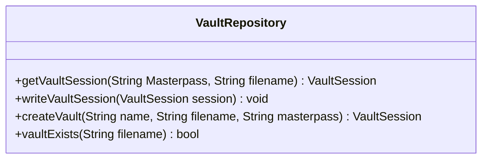
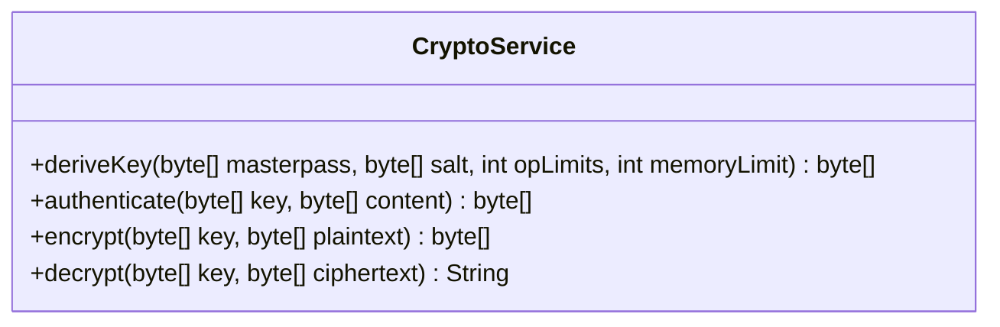
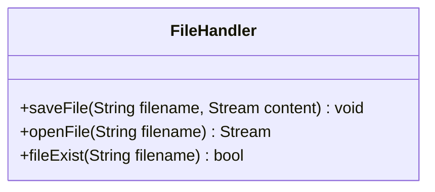
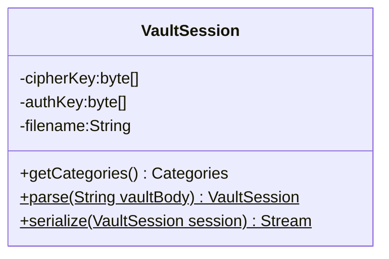
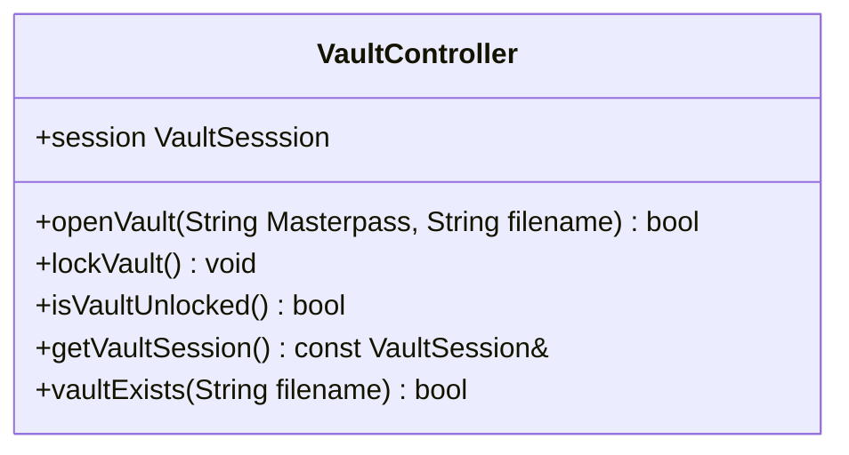
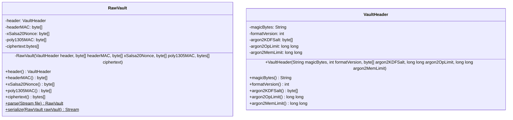
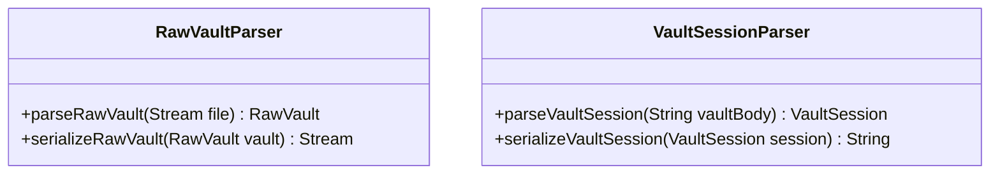
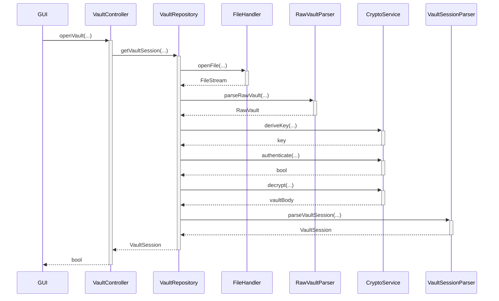
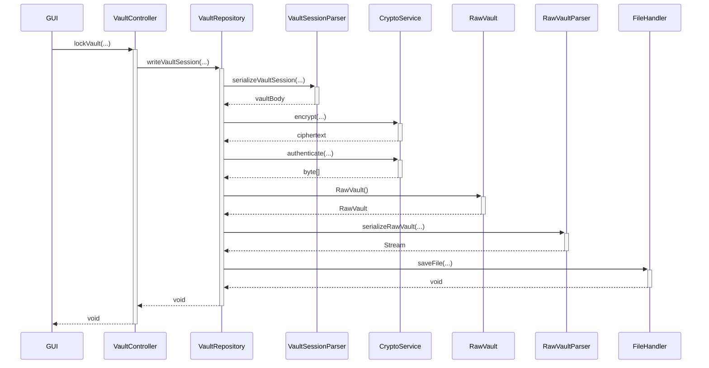

# Diagrams

## Class diagrams

### `VaultRepository`

### `CryptoService`

### `FileHandler`

### `VaultSession`

### `VaultController`

### `RawVault`

---

## Unlock vault sequence

## Lock vault sequence

