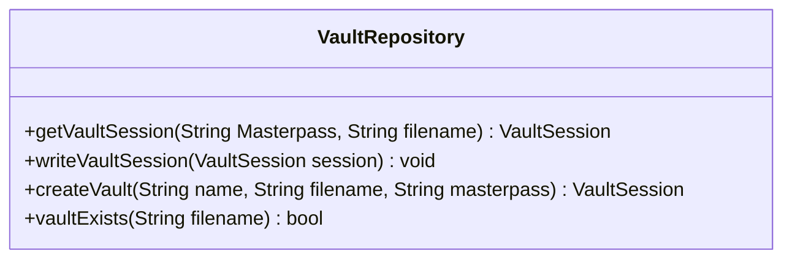
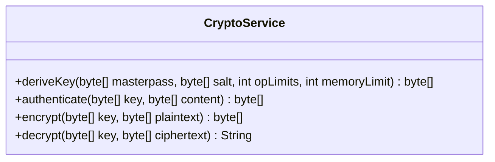
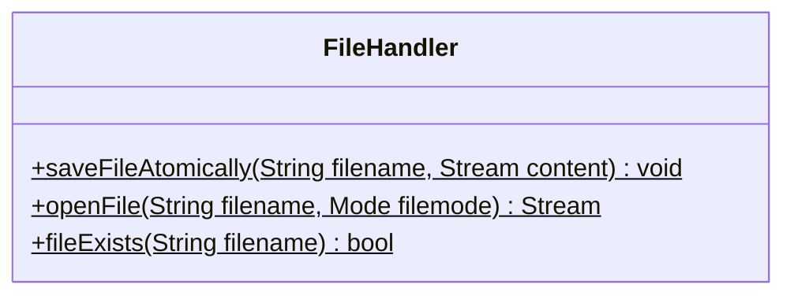
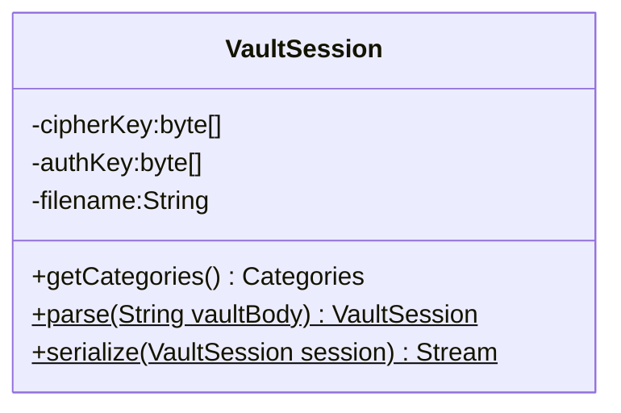
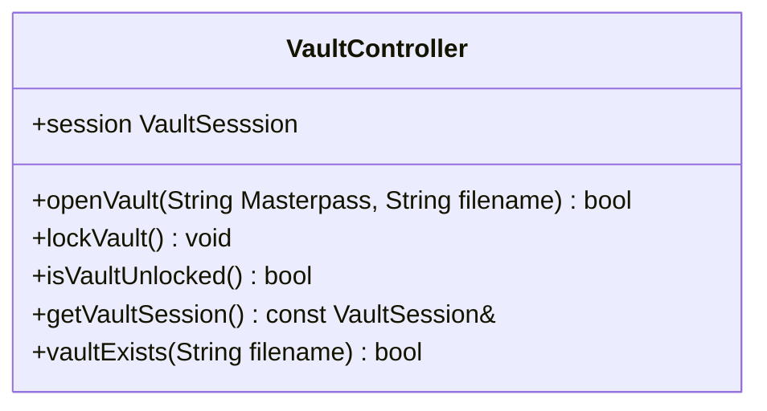
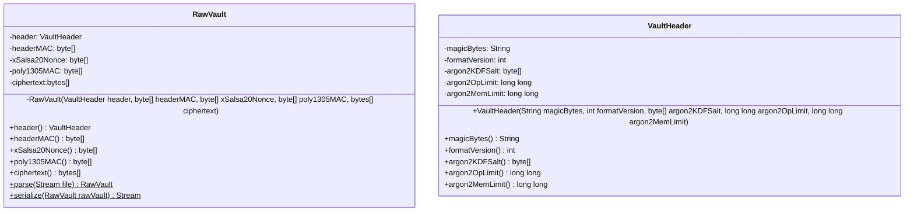
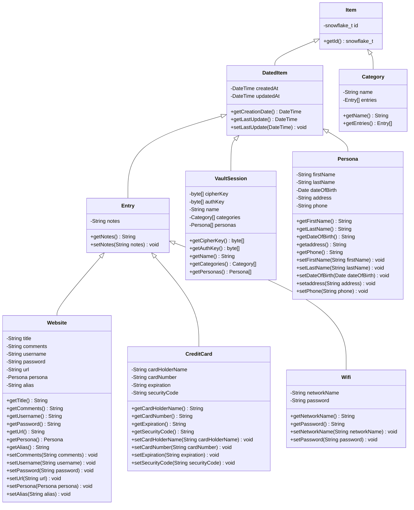
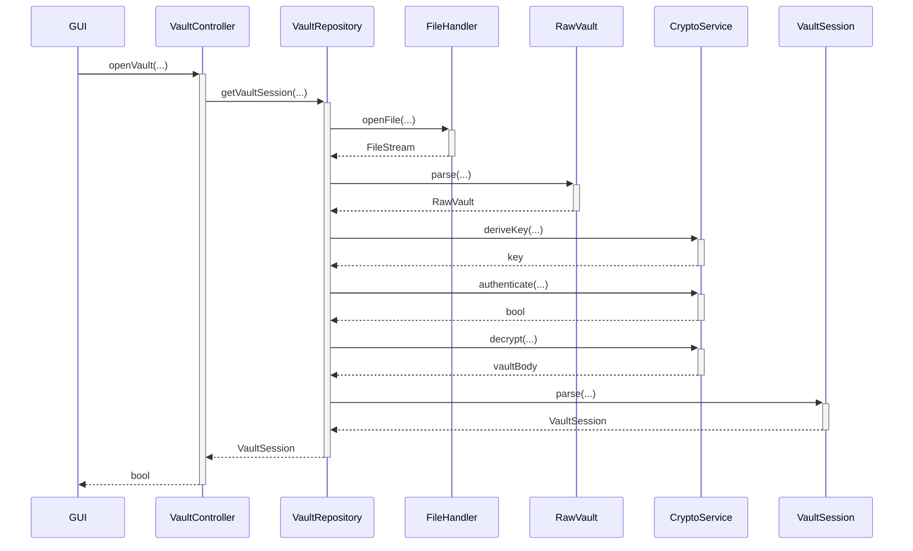
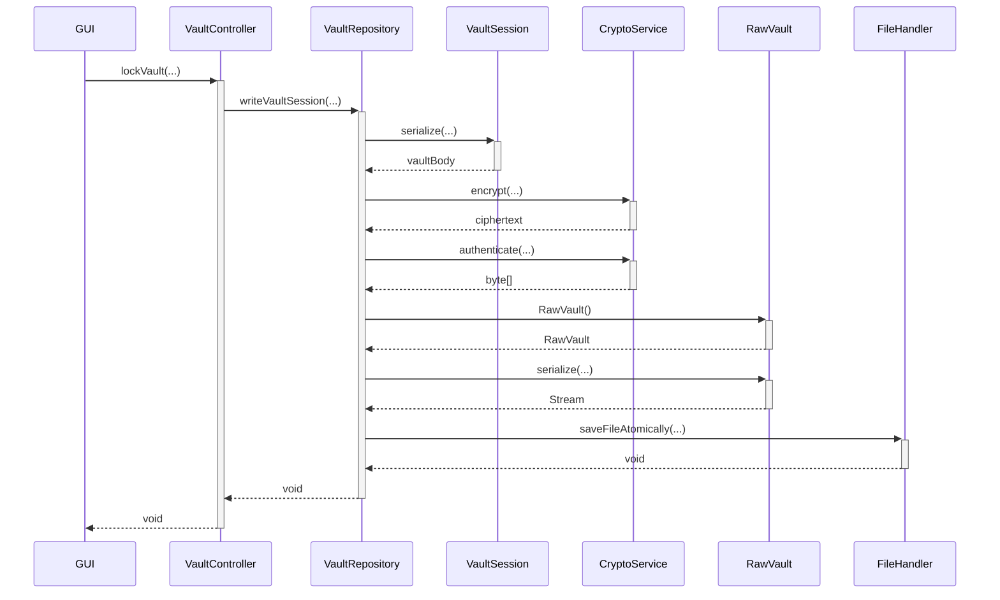
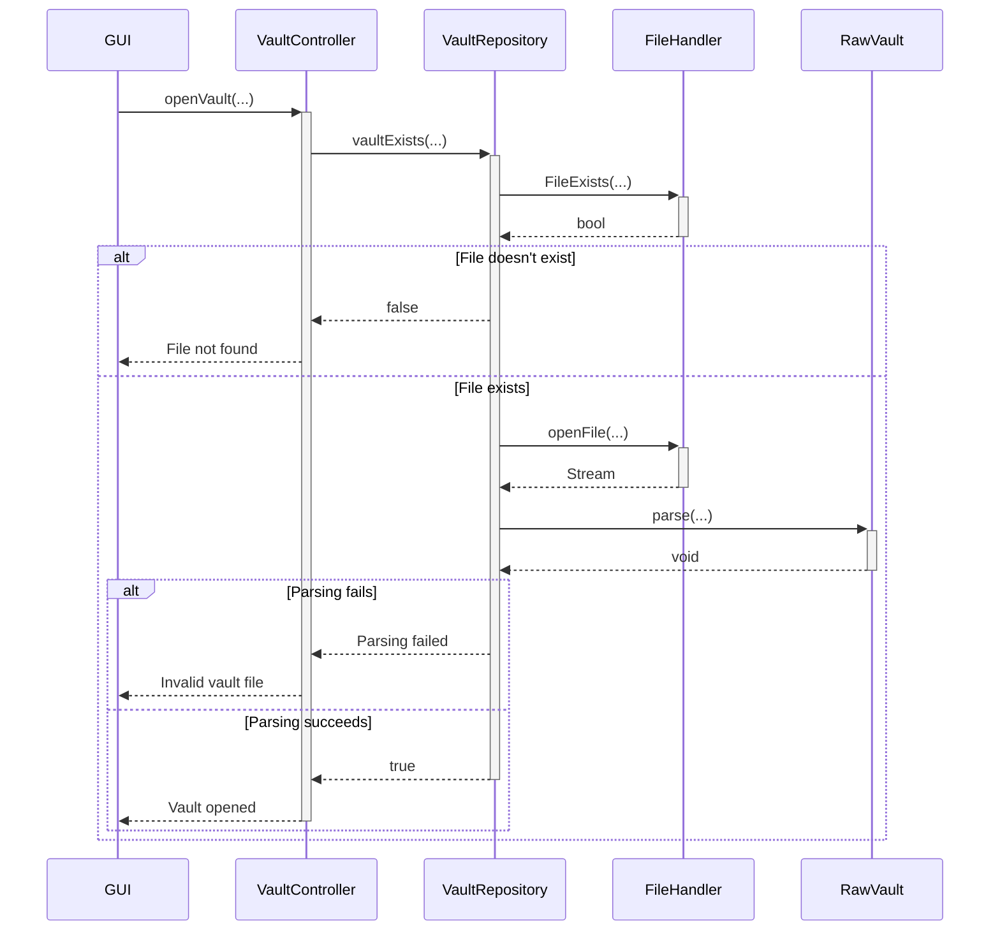

# Diagrams

## Class diagrams

### `VaultRepository`

### `CryptoService`

### `FileHandler`

### `VaultSession`

### `VaultController`

### `RawVault`

## Sequence diagrams

### Unlock vault sequence

### Lock vault sequence

### Open a Vault

