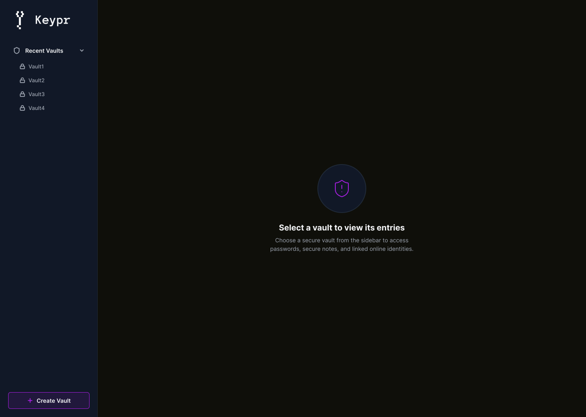
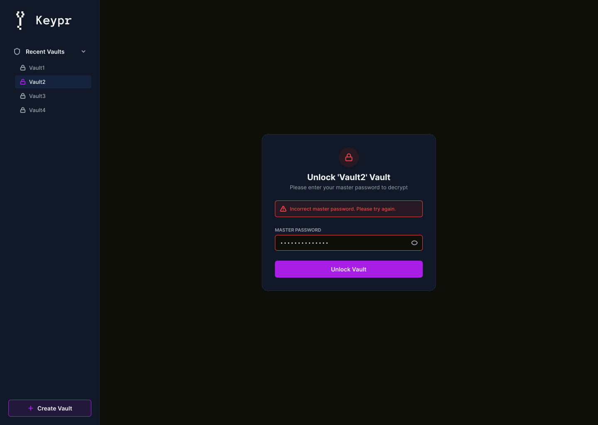
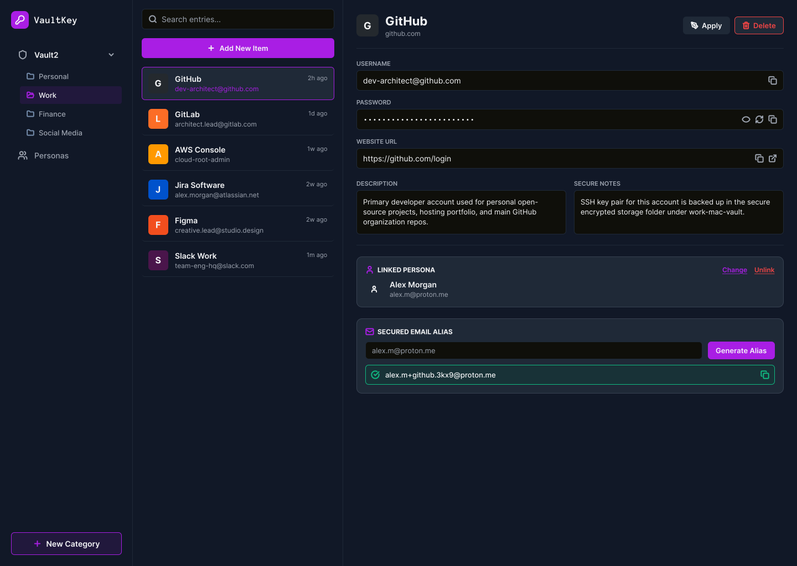
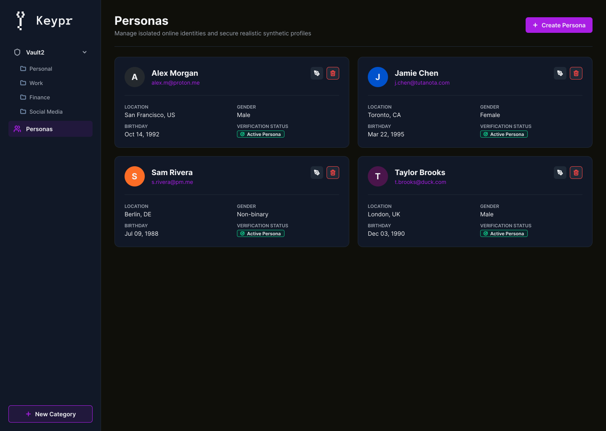
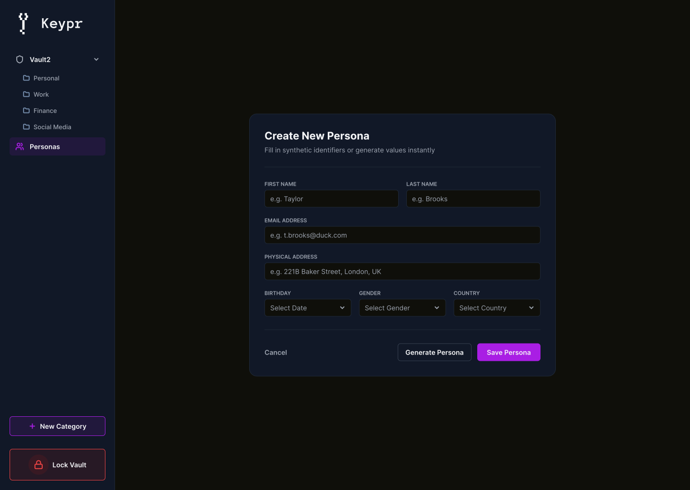
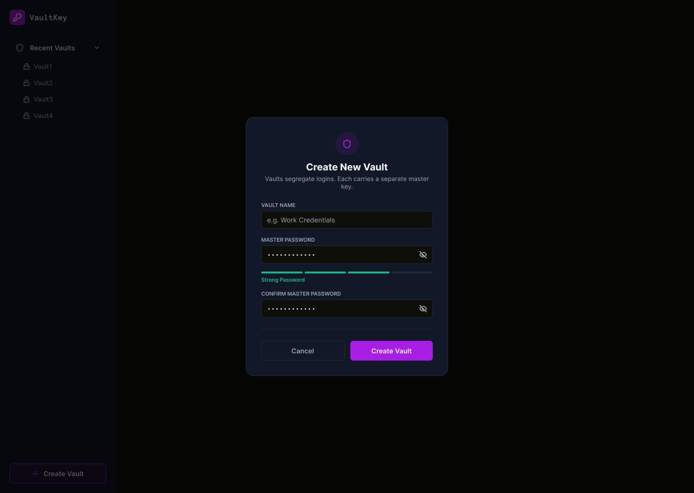

# Mockups 

This directory contains mockups for the project. Mockups are visual representations of the user interface and design elements. Those provide a better idea of how we envision the final product and help gathering ideas for the features and functionalities.

We've used Figma to create the mockups. Mockups are located inside the `app` directory.

## Color Palette

Here's the color palette used in the mockups:
- Primary Color: #1F2937 (Dark Blue)

- Background Color: #0F0F0B (Black)

- Accent Color: #A91EE4 (Purple)

- Text Color: #F3F4F6 (White)

- Secondary Text Color: #9CA3AF (Gray)

- Error Color: #EF4444 (Red)

- Success Color: #10B981 (Green)

## Examples

### Vault list mockup

---

### Master password mockup

---

### Unlocked vault details mockup

---

### Personas manager mockup

---

### Create persona form mockup

---

### Create vault modal mockup

