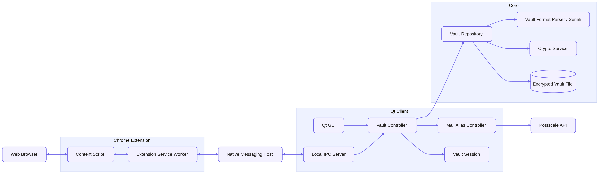

<!-- _class: lead -->

# **PDL 26**

## **Keypr** Password Manager

---

## Summary

1. Problem
2. Solution
3. Architecture
4. Team organization
5. Questions

---

## Problem

- Websites require more and more complex passwords
- Complex passwords are hard to remember
- Data breaches are frequent and often leak thousands of users personal information
  - More that 3000 recorded incidents in 2025 impacting ~278 millions persons.
- Compartmentalization can be tedious to a certain extent

---

## Solution

Our password manager solves those problems by providing the user with:

- A secure and encrypted way to store his password
- A convenient way of logging in into websites with the browser extension
- A way of creating "fake" identities (_personna_) and storing them along the corresponding entry
- An email aliasing system that simplifies compartmentalization

---

## Architecture

---

## Technologies (1/2)

- **Desktop client**:
  - Qt Widgets Framework with C++
  - QTest framework for the testing
- **Core library**:
  - C++ with libsodium for the Cryptographic
    - _Argon2d_ for the Key Derivation
    - _HMAC-SHA512_ for the header authentication
    - _XSalsa20_ stream cipher with _Poly1305_ to encrypt and authenticate vault content

---

## Technologies (2/2)

- **Browser extension**
  - Chrome Manifest V3
  - Typescript
  - Chrome Native Messaging (for inter-process communication)
  - Vitest as a testing framework
- **Email aliasing**:
  - [Post-scale API](https://postscale.io/products/masked-email-api)

---

<!-- _class: lead -->

## **Dev process**

---

## Methodology

- Scrum methodology
- One week long sprints
- The project will count 2 sprints corresponding to the 2 weeks left for the project

---

## Scrum organization

- Sprint planning at the beginning of the week
- Tasks for each user stories are defined and estimated during sprint planning
- At the end of each sprint (end of the week) takes place the sprint review
- During the sprint review we present the work that has been done and do a quick retrospective with the team on what went well and what to improve for next sprint.

---

## Team organization

- **Nolan**: Core
- **Alberto**: Web browser extension, IPC communication
- **Pierre**: Qt Client, email aliasing system
- **Maikol**: Qt client, IPC communication

---

## Project structure

The project has been separated into 5 parts/repositories:

1. Documentation
2. Landing page
3. Core library
4. Qt Client with the core as a git submodule
5. Browser extension

---

## Tasks management

The tasks and user stories are managed using [Github project](https://github.com/orgs/Keypr-org/projects/1)

---

<!-- _class: lead -->

## Git workflow

---

## Overall workflow

1. Assign the task to a member
2. Create a dedicated branch on the corresponding repository
3. Write the tests for the expected behavior
4. Implement the task so all the test cases pass
5. Create a pull request
6. Review the code (others review it)
7. Update code / tests based on others feedback
8. Merge the task to the _develop_ branch

---

## Branch organization

We'll be using `git flow` to manage features and development:

- **main** branch will be reserved to releases and is protected, we must create a pull request first
- **develop** branch is the main development branch where tasks that pass all the tests are merged, it's also protected
- **feature/<feature name>** branches are the feature branches where the tasks will be developed

---

## Review process

When reviewing a feature / task, a team member must at least:

- Check that all tests are passing and meaningful
- Check that the coding conventions are respected
- Check that the code is documented
- Read the changes ENTIRELY
- Provide a feedback to the author

---

<!-- _class: lead -->

## Mockups / Landing page

Link to the [landing page](https://keypr-org.github.io/landing_page/)

---

## Pipeline (1/4)

- **Qt Client**
  - _Develop_ branch workflow
    - Install dependencies
    - Build and test the project for each platform
    - Upload raw executables to GitHub
  - _Main_ branch workflow
    - Same as develop but the executable is packaged with all the required dependencies

---

## Pipeline (2/4)

- **Core**
  - _Main_ and _Develop_ workflows
    - Install dependencies (using vcpkg)
    - Build and test the project for each platform

---

## Pipeline (3/4)

- **Browser Extension**
  - _Develop_ workflow:
    - Install node.js modules
    - Check linting, build and test the project
    - Upload the built project to GitHub
  - _Main_ workflow
    - Same as _develop_ but pushes the extension to Chrome Web Store

---

## Pipeline (4/4)

- **Landing page**
  - _Main_ workflow
    - Setup and build with node
    - Deploy to _GitHub Pages_

---

<!-- _class: lead -->

## Pipeline demo

---

<!-- _class: lead -->

# Questions ?
