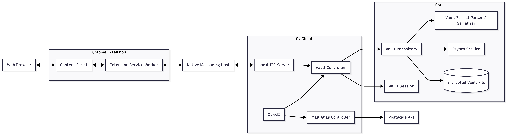

<!-- _class: lead -->

# **PDG 26**

## **Keypr** Password Manager

---

## Table of contents

1. Video demo of the application
2. Architecture
3. Dev process
4. Technologies
5. How it works
6. Conclusion
7. Questions

---

<!-- _class: lead -->

# Video demo of the application

---

<video width="1024" height="576" controls>
  <source src="./img/video-pdg.mp4" type="video/mp4">
</video>

---

## Project structure

The project has been separated into 5 parts/repositories:

1. Landing page
2. Core library
3. Qt Client with the core as a git submodule
4. Browser extension
5. Documentation

---

## Architecture

---

## Team organization

- **Nolan**: Core Library, IPC communication
- **Alberto**: Web browser extension, IPC communication
- **Pierre**: Qt Client, email aliasing system, Landing page
- **Maikol**: Qt Client, Controller, Core Library

- **All**: Documentation, testing, CI/CD

---

## Technologies (1/2)

- **Desktop client**:
  - Qt Widgets Framework with C++
  - QTest framework for the testing
- **Core library**:
  - C++
  - `libsodium` for cryptography
  - `nlohmann/json` for JSON serialization
  - `gtest` for unit testing

---

## Technologies (2/2)

- **Browser extension**
  - Chrome Manifest V3
  - Typescript
  - Chrome Native Messaging (for inter-process communication)
  - Vite & Vitest as a testing framework
- **Email aliasing**:
  - [Post-scale API](https://postscale.io/products/masked-email-api)

---

<!-- _class: lead -->

# How it works

---

## Vault file format (.kvdb)

- **Header**: Contains useful info such as the version of the file format, the salt used for key derivation etc ...
- **Body**: Contains the encrypted vault data containing the entries, personas, ..., stored as JSON

---

## Core library

Library that features all of the vault file parsing and cryptographic operations.

**Used to :**

- Format the vault file
- Encrypt and decrypt the vault file
- Derive the encryption key from the user's master password

---

## Desktop application

- **Qt Client**: Desktop application (GUI) that allows the user to manage their vault file and entries.
- **Features**:
  - Create a new vault file
  - Open an existing vault file
  - Add, edit and delete entries & personas
  - Generate strong passwords & alias email addresses
  - IPC with the browser extension

---

## Browser extension

Sends requests to the desktop application to retrieve the credentials of a website using Chrome Native Messaging.

- **Features**:
  - Autofills the login form of the website with the retrieved credentials (email and password).
  - Opens the desktop application when the application is not running.

---

## Email aliasing

**Features** :

- Protects your real email address
- Avoids spam (aliases are disposable)
- Allows you to create multiple email addresses for different purposes

**Requirements** :

- Domain name
- Post-scale API key

---

# End of project review

- ✅ 61 Users stories done
- 🟧 4 Users stories left

**Known issues:**

- Native messaging is not functional on Windows (well, well ...)
- Font glitches on Linux and Windows (Qt issue)

---

<!-- _class: lead -->

# Questions ?
