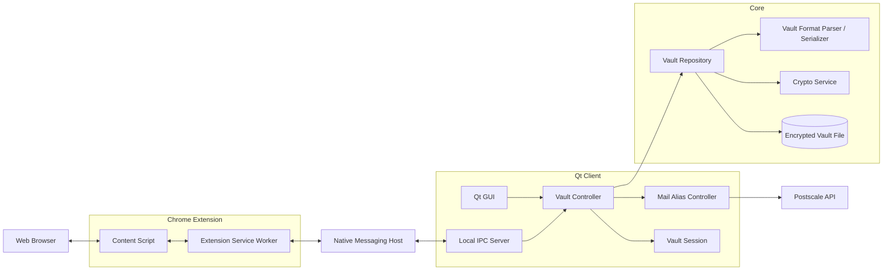

# Project Specification

## Table of contents

- [Project Specification](#project-specification)
  - [Table of contents](#table-of-contents)
  - [Objective](#objective)
  - [Functional requirements](#functional-requirements)
  - [Non-functional requirements](#non-functional-requirements)
    - [Security](#security)
    - [Performance](#performance)
    - [Reliability](#reliability)
    - [Compatibility](#compatibility)
    - [Usability](#usability)
  - [Architecture](#architecture)
    - [Software architecture](#software-architecture)
  - [Mockups / Landing page](#mockups--landing-page)
  - [Technical stack](#technical-stack)
    - [Desktop application](#desktop-application)
    - [Browser extension](#browser-extension)
    - [Core library](#core-library)
    - [Email Aliasing](#email-aliasing)

## Objective

Securely storing passwords has never been more important than today as many platforms require a long and difficult to guess password which are also hard for humans to remember. That's why a password manager is a must-have today. Additionally, as the number of data breaches increases it has never been more important to limit the amount of personal data you share to third parties as they often don't need to know your real informations.

We decided to build our own password manager that aims at preserving your privacy and securely storing your credentials. We give you the opportunity to generate a fictional character to avoid sharing your real informations when its not required and thus limit the impact of data breaches on your privacy.

## Functional requirements

- The user can store entries that can be website credentials (username, password, url, ...), wifi credentials or credit card informations.
- The user can create a fake character called a _persona_ to avoid giving its real identity to third party.
- The user can create an email alias that will redirect all emails sent to this alias to his email address while preventing him from giving out its real email.
- The user can associate a persona to an entry
- The user must enter its _master password_ to decrypt a given vault (each vault can have its own master password to decrypt it).
- The user can have multiple vaults
- The user can add/modify/delete entries from a _vault_.
- The user can generate random and secure passwords using the integrated password generator.
- The user can store entries in categories.
- The user can install the provided browser extension in its web browser to autofill his credentials from the _vault_.
- The user can use the browser extension to fill register forms with an existing _persona_.

## Non-functional requirements

### Security

- The _vaults_ are stored in a single encrypted file on disk.
- The entries are stored in a secure _vault_ which is a special file containing the encrypted entries.
- The password generator must generate uniformly random passwords
- The vault must store only encrypted data and follow the chosen file specification
- The vault data must be encrypted using a secure and well known cipher (E.g.: AES-256)
- The cipher key must be derived from the master password using suitable function such as Argon2id, scrypt or PBKDF2 with a unique salt for each _vault_.
- The master password must never be stored even temporarily in plain text.
- Copied content should be automatically removed from the clipboard after 30 seconds.
- The vault locks itself after 5 minutes.
- The vault must be unlocked for the browser extension to suggest passwords.
- The unlocking process of the _vault_ must feature a protection against brute-force attacks such as adding a delay between each try.
- The communication between the application and the browser extension must be authenticated.
- The browser extension must never receive the entire vault but only the required entry.

### Performance

- The decryption of the vault must take less than 1 second.
- The GUI must be reactive so the user experience is pleasant.

### Reliability

- Write operations to the vault must be atomic
- A crash of the app must not corrupt the _vault_.

### Compatibility

- The app must be cross-platform meaning it must work on Linux, MacOS and Microsoft Windows.
- The _vault_ must be accessible offline, if using a synchronisation solution the last accessed version must be accessible offline.
- The vault must be synchronisable between devices using a commercial cloud storage solution such as OneDrive, iCloud, etc.

### Usability

- The user must be able to lock the vault in one click.
- The error messages must be clear and tell the user how to proceed correctly.
- The sensitive entries (password, card number, ...) must be hidden by default.
- The app must feature keyboard shortcuts for frequently used features such as saving the changes made to the vault or copying the password of an entry.
- Actions that delete an entry must ask for confirmation beforehand.
- The browser extension should prompt the user for the master password if the _vault_ is locked.

## Architecture

### Software architecture

## Mockups / Landing page

Mockups of our application are available in the `/mockups` directory. Click [here](./mockups/README.md) to see them.

The landing page is available at [https://keypr-org.github.io/landing_page/](https://keypr-org.github.io/landing_page/)

## Technical stack

### Desktop application

For the desktop application we will use [Qt](https://www.qt.io/) as it is a cross-platform framework that allows us to build a native application for Linux, MacOS and Windows. It allows us to build a GUI with a modern look and feel. We will use C++ as the programming language for the desktop application.

As testing framework we will use [QTest](https://doc.qt.io/qt-6/qtest-overview.html) as it is a unit testing framework that is integrated with Qt and allows us to write unit tests for our application.

### Browser extension

To develop the browser extension we will use Chrome Manifest v3 as it is the latest version of the Chrome extension manifest and it is required for new extensions. It also provides a more secure and performant architecture for extensions. We will use [TypeScript](https://www.typescriptlang.org/) as the programming language for the browser extension.

We will use [Vitest](https://vitest.dev/) as the testing framework for the browser extension as it is a fast and lightweight testing framework.

To communicate between the browser extension and the desktop application we will use [Native Messaging](https://developer.chrome.com/docs/apps/nativeMessaging/) as it is a secure way to communicate between a browser extension and a native application. It allows us to send messages between the two applications using standard input and output streams.

### Core library

The core library will be implemented using C++.

Regarding the cryptography part, we will use [libsodium](https://libsodium.gitbook.io/doc/) as it is a well known and widely used library that provides a high level API for cryptography. It is also cross-platform and has a C++ wrapper.

For the cryptographic algorithms, we chose:

- [Argon2id](https://en.wikipedia.org/wiki/Argon2) as the key derivation function to derive the encryption key from the master password. It is a memory-hard function that is resistant to GPU attacks.
- [HMAC-SHA512-256](https://en.wikipedia.org/wiki/HMAC) as the message authentication code to ensure the integrity of header of the vault file. It will require the use of the master password to verify the integrity of the vault file.
- [XSalsa20](https://en.wikipedia.org/wiki/Salsa20#XSalsa20_with_192-bit_nonce) as the symmetric encryption algorithm to encrypt the vault file. It is a stream cipher that is fast and secure.
- [Poly1305](https://en.wikipedia.org/wiki/Poly1305) as the message authentication code to ensure the integrity of the encrypted data inside the vault file.

To pull [libsodium](https://libsodium.gitbook.io/doc/) and compile it for the different platforms we will use vcpkg. It is a cross-platform package manager that allows us to easily manage our dependencies and build our project for different platforms.

To test the code we will use [Google Test](https://github.com/google/googletest) testing framework.

### Email Aliasing

The email aliasing system will be taken care of by the [PostScale API](https://postscale.io/products/masked-email-api). It provides an API to create and delete email aliases called _Masked Email_ and it has a free plan.

The idea is that the user of our application can request its API key to poscale and add it to the app to take advantage of the email aliasing functionality.

We'll by using [Dynu DNS](https://www.dynu.com/en-US) as a DNS provider for the domain of the email aliases as it is free and allows us to create a free DNS Zone.
