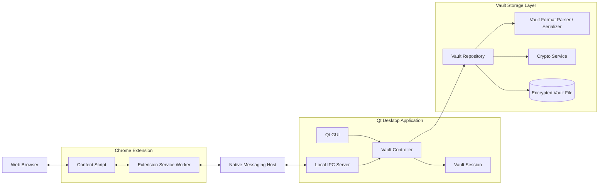
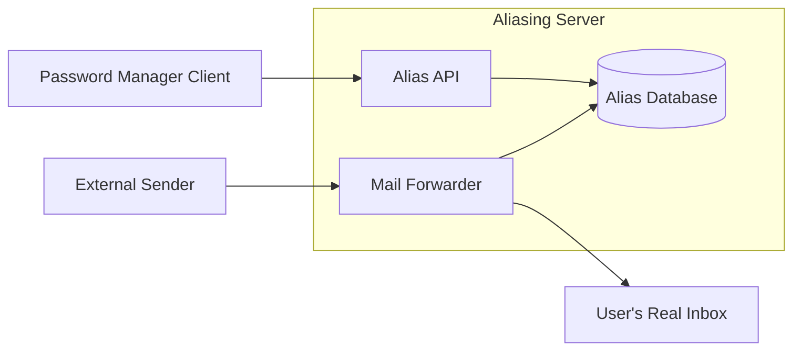

# Project Specification

## Objective

Securely storing passwords has never been more important than today as many platforms require a long and difficult to guess password which are also hard for humans to remember. That's why a password manager is a must-have today. Additionally, as the number of data breaches increases it has never been more important to limit the amount of personal data you share to third parties as they often don't need to know your real informations.

We decided to build our own password manager that aims at preserving your privacy and securely storing your credentials. We give you the opportunity to generate a fictional character to avoid sharing your real informations when its not required and thus limit the impact of data breaches on your privacy.

## Functional requirements

- The user can store entries that can be website credentials (username, password, url, ...), wifi credentials or credit card informations.
- The user can create a fake character called a _persona_ to avoid giving its real identity to third party.
- The user can create an email alias for a _persona_ that will redirect all emails sent to this alias to his email address while preventing him from giving out its real email.
- The user can associate a persona to an entry
- The user must enter its _master password_ to decrypt a given vault (each vault can have its own master password to decrypt it).
- The user can have multiple vaults
- The user can add/modify/delete entries from a _vault_.
- The user can generate random and secure passwords using the integrated password generator.
- The user can store entries in categories.
- The user can install the provided browser extension in its web browser to autofill his credentials from the _vault_.
- The user can use the browser extension to fill register forms with an existing _persona_.

## Non-functional requirements

### Security

- The _vaults_ are stored in a single encrypted file on disk.
- The entries are stored in a secure _vault_ which is a special file containing the encrypted entries.
- The password generator must generate uniformly random passwords
- The vault must store only encrypted data and follow the chosen file specification
- The vault data must be encrypted using a secure and well known cipher (E.g.: AES-256)
- The cipher key must be derived from the master password using suitable function such as Argon2id, scrypt or PBKDF2 with a unique salt for each _vault_.
- The master password must never be stored even temporarily in plain text.
- Copied content should be automatically removed from the clipboard after 30 seconds.
- The vault locks itself after 5 minutes.
- The vault must be unlocked for the browser extension to suggest passwords.
- The unlocking process of the _vault_ must feature a protection against brute-force attacks such as adding a delay between each try.
- The communication between the application and the browser extension must be authenticated.
- The browser extension must never receive the entire vault but only the required entry.

### Performance

- The decryption of the vault must take less than 1 second.
- The GUI must be reactive so the user experience is pleasant.

### Reliability

- Write operations to the vault must be atomic
- A crash of the app must not corrupt the _vault_.

### Compatibility

- The app must be cross-platform meaning it must work on Linux, MacOS and Microsoft Windows.
- The _vault_ must be accessible offline, if using a synchronisation solution the last accessed version must be accessible offline.
- The vault must be synchronisable between devices using a commercial cloud storage solution such as OneDrive, iCloud, etc.

### Usability

- The user must be able to lock the vault in one click.
- The error messages must be clear and tell the user how to proceed correctly.
- The sensitive entries (password, card number, ...) must be hidden by default.
- The app must feature keyboard shortcuts for frequently used features such as saving the changes made to the vault or copying the password of an entry.
- Actions that delete an entry must ask for confirmation beforehand.
- The browser extension should prompt the user for the master password if the _vault_ is locked.

## Architecture

### Software architecture

### Mail alias infrastructure

## Mockups

Mockups of our application are available in the `/mockups` directory. Click  to see them.
